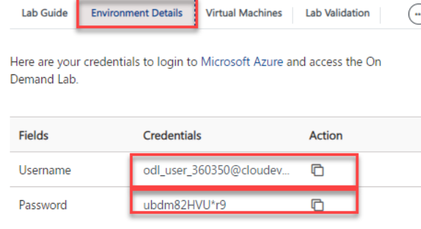

# Getting Started
## Log-in to the Azure Portal

1. In the virtual machine provided on the left side, open a new browser window and sign in to the **Azure Portal**.

1. Use the azure credentials provided in the **Environment Details** tab to log in to the portal.

## Local Development 

If you are working on your local computer, you can follow these steps to configure your environment to work with the labs. 

### C++ Redistributable 
1. Download and install the [Visual C++ Redistributable (x64)](https://aka.ms/vs/16/release/vc_redist.x64.exe) 
  >**Note**: If Already downloaded, Open an existing one.
  

### Python and required packages 
1. Install [Python 3.6.1](https://www.python.org/downloads/release/python-361/) 
1. Once it get Installed, Add Python to your Windows PATH, To do that, open up the Windows search bar and type python.exe (don't hit the Enter key). Then right-click on Python.exe that pops up in the resulting menu and select the Open file location option.

1. In the Explorer windows that opens, click on the long directory bar to the left of the search bar. Highlight and copy the entire path text to your clipboard with Ctrl + c. Then continue with the next steps below.

1. To add Python to the PATH in User variables, right-click on This PC, and select Properties. Once in the properties menu, click on the Advanced system settings option. In the next window, select the Advanced tab, and select Settings

1.click on New. Next, in the Variable name form, type Path, and paste your Python path in the Variable value field.

1. Go back to your Python installation path folder and double-click on Scripts to open that directory. Next, copy its path from the path bar at the upper part of the windows (besides the search bar), just like you did earlier for the Python installation path.

1. Once you've copied the Scripts path, head back to the Environment Variables. Next, select the Path variable and click on Edit. Type a semi-colon after your Python executable path and paste the Scripts path you just copied after it. Then click Ok.

1.. After added path to the environment path, open *Command Prompt* and enter the following command to install the necessary packages: 

> pip install ipython jupyter matplotlib pillow requests azure-cognitiveservices-vision-computervision azure-cognitiveservices-vision-customvision azure-cognitiveservices-vision-face azure-cognitiveservices-language-textanalytics azure.cognitiveservices.speech azure_ai_formrecognizer 

### Visual Studio Code 
1. If you do not have Visual Studio Code already, [download it here]](https://code.visualstudio.com/Download). After installation, start Visual Studio Code and on the Extensions tab (CTRL+SHIFT+X), search for and install the **Python** extension from Microsoft.

2. In Visual Studio Code, open a new Terminal, type **git clone https://github.com/MicrosoftLearning/mslearn-ai900** and select *enter*. 

 
